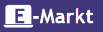
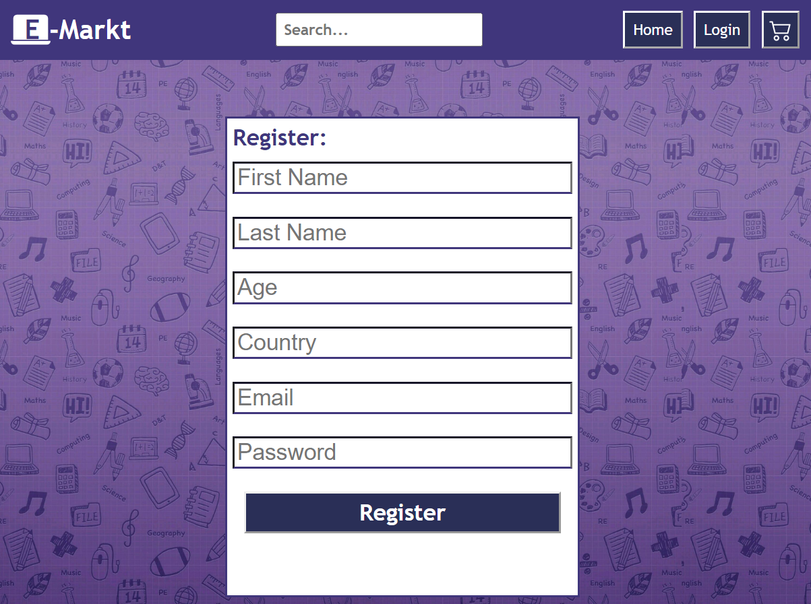
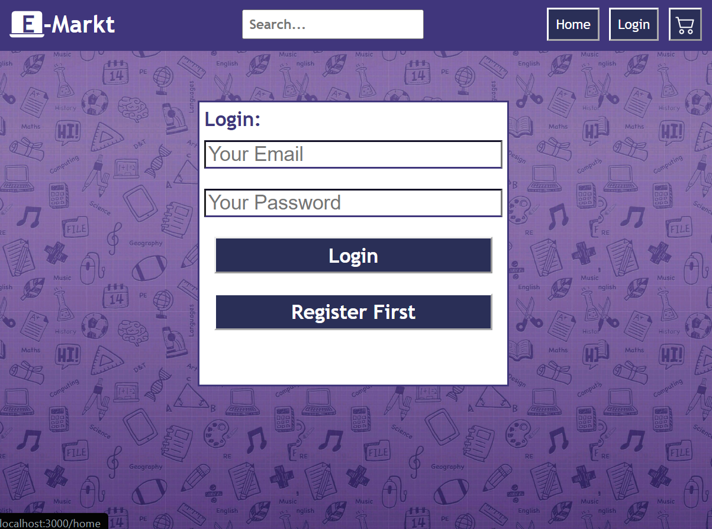
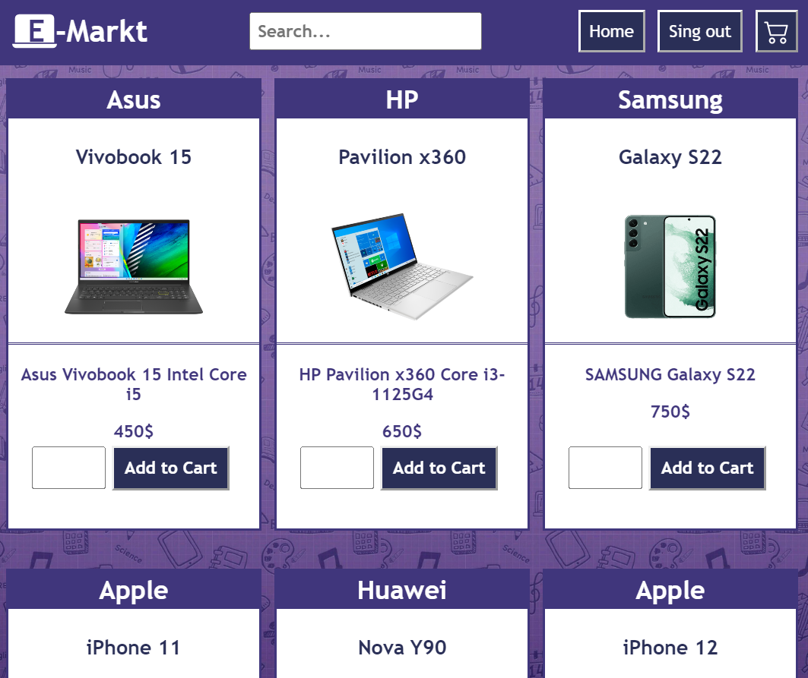

<p align="center">
  <a href="" rel="noopener">
 </a>
</p>

<h3 align="center">E-Markt</h3>

---

<p align="center"> E-Markt is an online markt, which offers the best services to give our custmors the best online shopping experience.
    <br> 
<a href=''>Demo</a>
    <br> 
</p>

## 📝 Table of Contents

- [About](#about)
- [Getting Started](#getting_started)
- [Usage](#usage)
- [Built Using](#built_using)
- [User Story](#user_story)
- [Data Flow](#data_flow)
- [Guided By](#guided_by)

## 🧐 About <a name = "about"></a>

Write about 1-2 paragraphs describing the purpose of your project.

Ex. Are you looking for a quick and easy way to buy a new smartphone or laptop? The **(E-Markt)** is the greatest and most accurate application to do this for you. It helps you to **(buy computers and mobiles)**. The **(E-Markt)** provides a simple design to ensure having the best user experience.

## 🏁 Getting Started <a name = "getting_started"></a>

These instructions will get you a copy of the project up and running on your local machine for development and testing purposes.

### Prerequisites

- Visual Studio Code follow this <a href=''>link</a> to install.
- Git Bash follow this <a href=''>link</a> to install.
- MongoDB follow this <a href=''>link</a> to install.
- Node.js follow this <a href=''>link</a> to install.

### Installing:

1. Clone the repo to your local machine using git bash.

```
git clone https://github.com/C6-OmarAlduais/MERAKI_Academy_Project_4.git
```

2. Install packeges repeat this step in backend and frontend folder

```
npm i
```

3. Run server using git bash inside backend folder

```
npm run dev
```

4. Run application using git bash inside frontend folder

```
npm start
```

Now app ready to use


## 🎈 Usage <a name="usage"></a>

- You have to register to navigate our web app
You can click on the **Login** then choose register



- You can click on the **Login** again to log in 



- You can click on the **Home** tab see all our products and to search



- You can click on the **Add to cart** button to add this product to your cart but you have to be one of our users, so you should create an account 

## ⛏️ Built Using <a name = "built_using"></a>

- [MongoDB](https://www.mongodb.com/) - Database
- [Express JS](https://expressjs.com/) - Server Framework
- [React JS](https://https://reactjs.org/) - Web Framework
- [Node JS](https://nodejs.org/en/) - Server Environment

## User Story <a name = "#user_story"></a>

Your trello board link
<a href=''>Trello</a>

## Data Flow <a name = "#data_flow"></a>

</a>

## ⚠️ Guided By <a name = "guided_by"></a>

This project is guided by ©️ **[MERAKI Academy](https://www.meraki-academy.org)**
